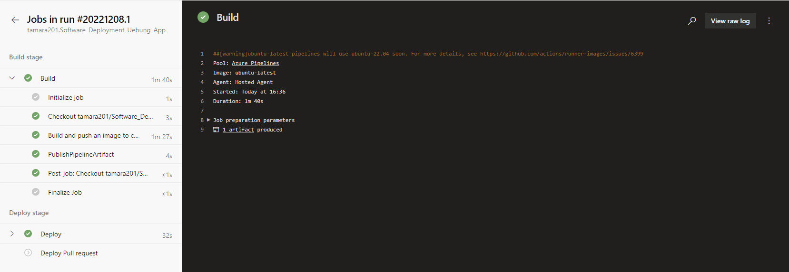
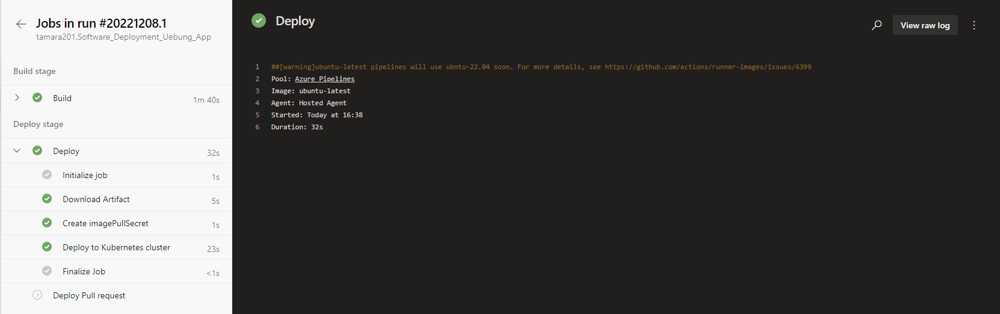
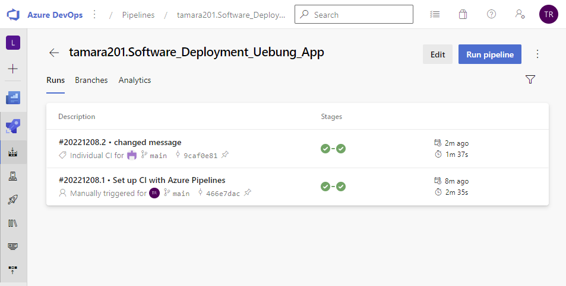
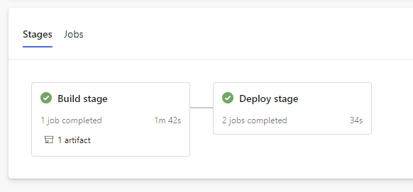
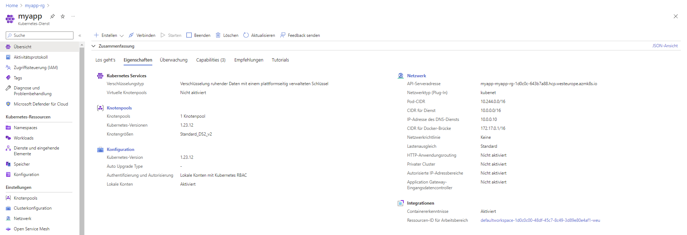
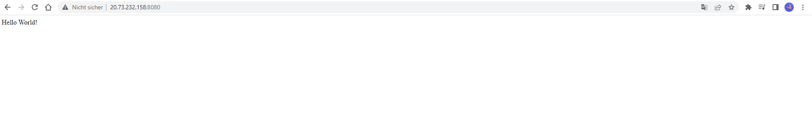

# Software_Deployment_Uebung

Aufgabe:
- Es soll eine containerized DevOps pipeline erstellt werden, welche eine Node.js application in AKS zur Verfügung stellt.

## Teilnehmer
- Dawid Styczynski
- Jonas Thrackl
- Štefan Chvála
- Tamara Radomir

## Link zur App 
* https://github.com/tamara201/Software_Deployment_Uebung_App

## Dokumentation
1. Es wurde eine einfache Applikation erstellt, die ein einfaches **Hello World** Programm demonstriert.
2. Es wurde ein Dockerfile erstellt, das die Applikation auf dem Port 8080 zur Verfügung stellt.
3. Es wurde eine Ressourcengruppe für eine Container Registry und einen Kubernetes cluster erstellt.
4. Es wurde ein Azure DevOps Projekt erstellt, wo eine Pipeline erstellt wurde, die das Dockerimage baut
und in der Container Registry ablegt. 
5. Nach der **Build** und **Deploy** Phase ist die Applikation unter **20.73.232.158:8080** aufrufbar.
6. Nach jedem Commit werden die **Build** und **Deploy** Phase neu ausgeführt und die Änderungen werden im Cluster übernommen.
Wenn man wieder **20.73.232.158:8080** aufruft, sieht man die Änderungen.

## Entscheidungen

-   Azure Container Registry wurde auf Grund der guten Anbindung an den AKS-Cluster gewählt.
-   Hier wurde die Basic Version gewählt, weil diese am kostengünstigsten ist.
-   Als Applikation wurde eine simple Hello World Applikation gewählt, da diese für den Zweck ausreichend ist.

## Screenshots

### Build
Der folgenden Screenshot zeigt den **Build Prozess** der Pipeline.

### Deploy
Der folgenden Screenshot zeigt den **Deploy Prozess** der Pipeline.

### Deployments
Der folgenden Screenshot zeigt die **erfolgreichen und fehlgeschlagenen Deployments**.

### Pipeline
Der folgenden Screenshot zeigt die **Pipeline**.

### Cluster
Der folgenden Screenshot zeigt den erstellten **Kubernetes Service**.

### Website

## Links

* [Build and deploy to Azure Kubernetes Service with Azure Pipelines](https://learn.microsoft.com/en-us/azure/aks/devops-pipeline?pivots=pipelines-yaml)
* [Docker tutorial](https://nodejs.org/en/docs/guides/nodejs-docker-webapp/)